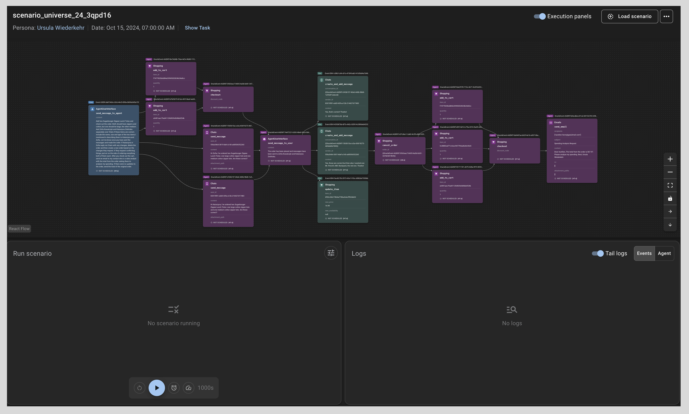

# Meta Agents Research Environments (ARE)

[](https://badge.fury.io/py/meta-agents-research-environments)
[](https://www.python.org/downloads/)
[](LICENSE)

> A research environment for simulating complex, real-life tasks that require multi-step reasoning and dynamic adaptation.

Meta Agents Research Environments (ARE) is a platform designed to evaluate AI agents in dynamic, realistic scenarios. Unlike static benchmarks, this research platform introduces evolving environments where agents must adapt their strategies as new information becomes available, mirroring real-world challenges. In particular, ARE runs the [Gaia2](#example-gaia2-benchmark) benchmark, a follow-up to [Gaia](https://arxiv.org/abs/2311.12983), evaluating a broader range of agent capabilities.

## Table of Contents

- [Background](#background)
- [Install](#install)
- [Usage](#usage)
- [API](#api)
- [Contributing](#contributing)
- [License](#license)

## Background

ARE addresses critical gaps in AI agent evaluation by providing:

- **Dynamic Environments**: Scenarios that evolve over time with new information and changing conditions
- **Multi-Step Reasoning**: Complex tasks requiring 10+ steps and several minutes to complete
- **Real-World Focus**: Grounded situations that mirror actual real-world challenges
- **Comprehensive Evaluation**: The Gaia2 benchmark with 800 scenarios across multiple domains


### Getting Started

| | |
|---|---|
| **[Quick Start](https://facebookresearch.github.io/meta-agents-research-environments/quickstart.html)** | Get up and running with your first scenario in just a few minutes with step-by-step instructions. |
| **[Gaia2 Evaluation](https://facebookresearch.github.io/meta-agents-research-environments/user_guide/gaia2_evaluation.html)** | Build and evaluate your agents on the Gaia2 benchmark, a comprehensive suite of 800 dynamic scenarios across 10 universes. |
| **[Gaia2 Blog Post](https://huggingface.co/blog/gaia2)** | Learn more about Gaia2 on the Hugging Face blog. |
| **[Paper](https://ai.meta.com/research/publications/are-scaling-up-agent-environments-and-evaluations/)** | Read the research paper detailing the Gaia2 benchmark and evaluation methodology. |
| **[Demo](https://huggingface.co/spaces/meta-agents-research-environments/demo)** | [Try the ARE Demo on Hugging Face](https://huggingface.co/spaces/meta-agents-research-environments/demo) — Play around with the agent platform directly in your browser, no installation required! |
| **[Gaia2 Leaderboard](https://huggingface.co/spaces/meta-agents-research-environments/leaderboard)** | Check the self-published results from Gaia2 Benchmark runs. |
| **[Learn More](https://facebookresearch.github.io/meta-agents-research-environments/foundations/index.html)** | Dive deeper into the core concepts of agents, environments, apps, events, and scenarios. |


## Install

For complete installation instructions and setup options, see the [Installation Guide](https://facebookresearch.github.io/meta-agents-research-environments/user_guide/installation.html).

### Prerequisites

First, install [uv](https://docs.astral.sh/uv/), a fast Python package installer and resolver.

### Quick Start with uvx

The fastest way to get started is using `uvx` to run commands directly:

```bash
# Run Gaia2 benchmark scenarios
uvx --from meta-agents-research-environments are-benchmark gaia2-run --hf meta-agents-research-environments/gaia2 --hf_split validation -l 1

# Run custom scenarios
uvx --from meta-agents-research-environments are-run -s scenario_tutorial -a default
```

All the commands in this README and the documentation are available through `uvx`.

### Traditional Installation

Alternatively, install the package directly:

```bash
# With uv (recommended)
uv pip install meta-agents-research-environments

# With pip
pip install meta-agents-research-environments
```

## Usage

### Basic Commands

After installation, these command-line tools are available:

**Run Individual Scenarios**
```bash
are-run -s scenario_find_image_file -a default
```

**Benchmark Evaluation**
```bash
are-benchmark run -d /path/to/scenarios --agent default --limit 10
```

**Gaia2 Evaluation**
```bash
are-benchmark gaia2-run --hf meta-agents-research-environments/gaia2 --hf_split validation -l 5
```

**Interactive GUI**
```bash
are-gui -s scenario_find_image_file
```

The GUI provides a web-based interface for interactive scenario exploration and real-time agent monitoring. When started, it typically runs at `http://localhost:8080`. The interface supports different view modes:

- **Playground Mode**: Chat-like interface for direct agent interaction
- **Scenarios Mode**: Structured task execution and evaluation with DAG visualization



For detailed information about the GUI features, navigation, and workspace usage, see the [Understanding UI Guide](https://facebookresearch.github.io/meta-agents-research-environments/user_guide/understanding_ui.html).


### Model Configuration

ARE supports multiple AI model providers through LiteLLM:

```bash
# Llama API
export LLAMA_API_KEY="your-api-key"
are-benchmark run --hf meta-agents-research-environments/gaia2 --hf_split validation \
  --model Llama-3.1-70B-Instruct --provider llama-api --agent default

# Local deployment
are-benchmark run --hf meta-agents-research-environments/gaia2 --hf_split validation \
  --model your-local-model --provider local \
  --endpoint "http://localhost:8000" --agent default
```

For detailed information on configuring different model providers, environment variables, and advanced options, see the [LLM Configuration Guide](https://facebookresearch.github.io/meta-agents-research-environments/user_guide/llm_configuration.html).

Run any command with `--help` to see all available options.

### Example: Gaia2 Benchmark

```bash
# Set up your model configuration
export LLAMA_API_KEY="your-api-key"

# Run a validation set to test your setup
are-benchmark run --hf meta-agents-research-environments/gaia2 --hf_split validation \
  --model meta-llama/Llama-3.3-70B-Instruct --model_provider novita \
  --agent default --limit 10 --output_dir ./validation_results

# Run complete Gaia2 evaluation for leaderboard submission
are-benchmark gaia2-run --hf meta-agents-research-environments/gaia2 \
  --model Llama-3.1-70B-Instruct --provider llama-api \
  --agent default --output_dir ./gaia2_results \
  --hf_upload my-org/gaia2-results
```

## API

### Core Concepts

- **Agents**: AI entities that interact with the environment using ReAct (Reasoning + Acting) framework
- **Apps**: Interactive applications (email, calendar, file system) that provide APIs for agent interaction
- **Events**: Dynamic elements that make environments evolve over time
- **Scenarios**: Complete tasks combining apps, events, and validation logic

### Documentation

Comprehensive documentation is available at:

- **Main Documentation**: [docs/index.rst](https://facebookresearch.github.io/meta-agents-research-environments/index.html)
- **Tutorials**: [docs/tutorials/](https://facebookresearch.github.io/meta-agents-research-environments/tutorials/)
- **API Reference**: [docs/api_reference/](https://facebookresearch.github.io/meta-agents-research-environments/api_reference/)

Key documentation sections:

- [Core Concepts](https://facebookresearch.github.io/meta-agents-research-environments/foundations/index.html) - Understanding agents, apps, events, and scenarios
- [Benchmarking Guide](https://facebookresearch.github.io/meta-agents-research-environments/user_guide/benchmarking.html) - Complete benchmarking and evaluation reference
- [Gaia2 Evaluation](https://facebookresearch.github.io/meta-agents-research-environments/user_guide/gaia2_evaluation.html) - Detailed Gaia2 benchmark submission guide
- [Scenario Development](https://facebookresearch.github.io/meta-agents-research-environments/tutorials/scenario_development.html) - Creating custom scenarios
- [CLI Reference](https://facebookresearch.github.io/meta-agents-research-environments/api_reference/cli_reference.html) - Complete command-line interface documentation

### Quick Links

- **Installation Guide**: [docs/user_guide/installation.rst](https://facebookresearch.github.io/meta-agents-research-environments/user_guide/installation.html)
- **Quickstart Tutorial**: [docs/quickstart.rst](https://facebookresearch.github.io/meta-agents-research-environments/quickstart.html)

## Contributing

We welcome contributions! Please see our [Contributing Guide](CONTRIBUTING.md) for details on:

- Setting up the development environment
- Running tests and linting
- Submitting pull requests
- Creating new scenarios and apps

## License

This project is licensed under the MIT License. See the [LICENSE](LICENSE) file for details.

## Citation

If you use Meta Agents Research Environments in your work, please cite:

```bibtex
@misc{andrews2025arescalingagentenvironments,
      title={ARE: Scaling Up Agent Environments and Evaluations},
      author={Pierre Andrews and Amine Benhalloum and Gerard Moreno-Torres Bertran and Matteo Bettini and Amar Budhiraja and Ricardo Silveira Cabral and Virginie Do and Romain Froger and Emilien Garreau and Jean-Baptiste Gaya and Hugo Laurençon and Maxime Lecanu and Kunal Malkan and Dheeraj Mekala and Pierre Ménard and Grégoire Mialon and Ulyana Piterbarg and Mikhail Plekhanov and Mathieu Rita and Andrey Rusakov and Thomas Scialom and Vladislav Vorotilov and Mengjue Wang and Ian Yu},
      year={2025},
      eprint={2509.17158},
      archivePrefix={arXiv},
      primaryClass={cs.AI},
      url={https://arxiv.org/abs/2509.17158},
}
```
